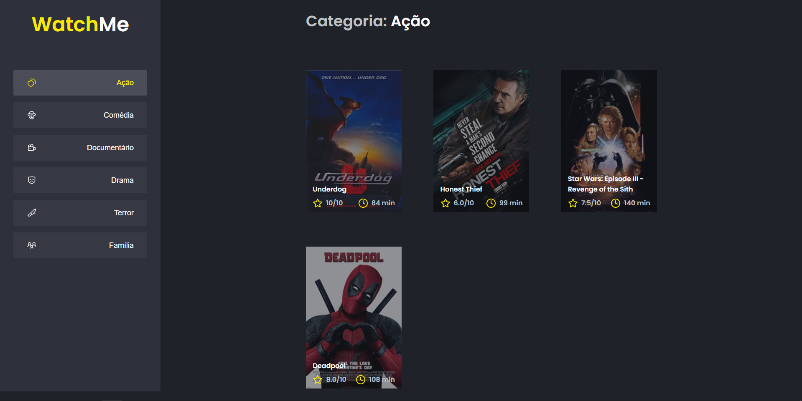

<h1 align="center">
 WatchMe
</h1>

  <a href="#-tecnologias">Tecnologias</a>&nbsp;&nbsp;&nbsp;|&nbsp;&nbsp;&nbsp;
  <a href="#-projeto">Projeto</a>&nbsp;&nbsp;&nbsp;|&nbsp;&nbsp;&nbsp;
  <a href="#-como-executar">Como executar</a>&nbsp;&nbsp;&nbsp;|&nbsp;&nbsp;&nbsp;
  <a href="#-Licença">Licença</a>&nbsp;&nbsp;&nbsp;&nbsp;&nbsp;&nbsp;

 

  

## ✨ Tecnologias

Esse projeto foi desenvolvido com as seguintes tecnologias:

- [React](https://reactjs.org)
- [TypeScript](https://www.typescriptlang.org/) 
- [Axios](https://github.com/axios/axios) 
- [Sass](https://sass-lang.com/)
- [Json Server] 

## 💻 Projeto

O WatchMe é um projeto realizado durante o bootcamp Ignite da Rocketseat, nele praticamos a componentização no reactJS, sua tabela de filmes muda dinâmicamente os dados da fake api conforme o genêro selecionado.

## 🚀 Como executar

- Clone o repositório
- Instale as dependências com `yarn`
- Inicie o servidor com `yarn dev` 
- inicie o json server com `yarn server`

Agora você pode acessar [`localhost:8080`](http://localhost:8080) do seu navegador.

## 📝 Licença 

Esse projeto está sob a licença MIT. Veja o arquivo [LICENSE](/LICENSE) para mais detalhes. 

#
